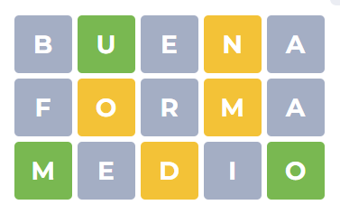
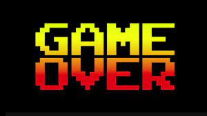

# Wordle
Juego de adivinar la palabra en 6 intentos, dando como pistas las letras que si son parte de la palabra.

# Instrucciones
El usuario al dar inicio al juego, se generara un cuadro de 5 columnas y 6 filas, dando entender que es una palabra de 5 letras y solo tiene 6 oportunidades para encontrar la palabra.

Cuándo se teclea alguna palabra dentro del rango, se debe verificar que sea una palabra que exista en el diccionario, despúes de la verificación, se va checando letra por letra, en donde habra tres posibilidades:

- Si la letra no se encuentra en la palabra dada por el sistema, se pondra en un color gris.
- Si la letra esta en la posición correcta al igual que la palabra dada por el sistema, se pondra en un color verde.
- Si la letra existe dentro la palabra, pero no se puso en la posición correcta, se pondra en un color amarillo.

Al poner la palabra, si esta no se econtro, se pasara a la siguiente fila para poder poner una nueva. Los puntos obtenidos dependen de en que fila se encontro la palabra.

### Caso 1: El usuario no encontro la palabra en el límite de oportunidades

Se perdera automaticamente y se mostrara en pantalla un mensaje de "GAME OVER" y después podra ver la puntuación total que consguio el usuario, dicha puntuación se guardar en el "top table" del menu.

### Caso 2: El usuario encontro la palabra en el límite de oportunidades

Se pasara al sigueinte nivel y se mostrara lo que en un inicio se mostro, el cuadro con N columnas y M filas. La puntutación se ira sumando por cada nivel que se esté avanzando, al pasar 5 palabras correctas sin haberse equivocado, se aumentara el numero de columnas para que sea una palabra con más letras, cuándo se llegue a 8 columnas, lo que se disminuira, sera el número de oportunidades. Teniendo como límite final, un total de 3 filas y 8 columnas.
